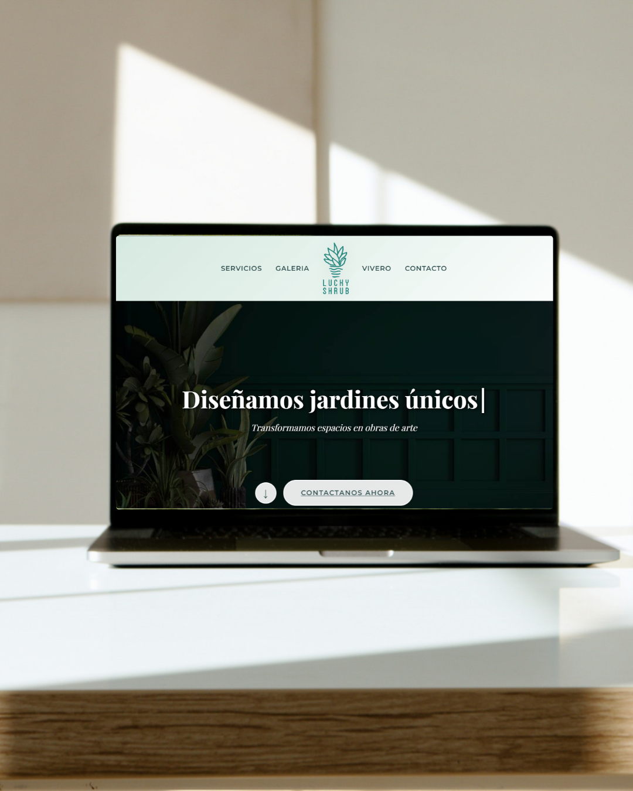

# 🌿 Lucky Shrub - Sitio Web de Jardinería y Paisajismo
[Lucky Shrub - Jardinería y Paisajismo](https://avalob.github.io/lucky-shrub-website/)



## 📋 Descripción del Proyecto

**Lucky Shrub** es un sitio web moderno y completamente responsive desarrollado como proyecto final del curso **"HTML and CSS in depth"** de Meta en Coursera. El sitio representa una empresa ficticia de jardinería y paisajismo, implementando todas las técnicas avanzadas aprendidas en el curso.

### 🎯 Objetivo del Proyecto
Demostrar el dominio completo de HTML5 y CSS3 avanzado, creando una experiencia web profesional que incluye:
- Diseño responsive y mobile-first
- Animaciones CSS avanzadas
- Optimización de rendimiento
- Mejores prácticas de accesibilidad
- JavaScript vanilla para interactividad

---

## 🚀 Características Principales

### ✨ Diseño y UX
- **Diseño Responsive Completo**: Adaptable a todos los dispositivos (móvil, tablet, desktop)
- **Animaciones CSS Avanzadas**: Transiciones suaves, efectos hover, animaciones de entrada
- **Navegación Intuitiva**: Menú sticky con efectos de scroll
- **Tipografía Profesional**: Google Fonts (Montserrat + Playfair Display)
- **Paleta de Colores Coherente**: Variables CSS para consistencia visual

### 🛠️ Funcionalidades Técnicas
- **HTML5 Semántico**: Estructura clara y accesible
- **CSS Grid y Flexbox**: Layouts modernos y flexibles
- **Lazy Loading**: Optimización de carga de imágenes
- **Modal Gallery**: Galería interactiva con JavaScript
- **Filtros Dinámicos**: Sistema de filtrado en tiempo real
- **SEO Optimizado**: Meta tags, Schema.org, estructura semántica

### 📱 Páginas Implementadas
1. **Inicio** (`index.html`) - Landing page principal
2. **Servicios** (`servicios.html`) - Descripción detallada de servicios
3. **Galería** (`galeria.html`) - Portfolio de proyectos con filtros
4. **Vivero** (`vivero.html`) - Catálogo de plantas y productos
5. **Contacto** (`contacto.html`) - Formulario y datos de contacto

---

## 🖼️ Capturas de Pantalla

### 🏠 Página Principal
La landing page presenta un banner hero con texto animado, secciones de servicios destacados, galería de proyectos y testimonios de clientes.


### 🎨 Galería de Proyectos
Sistema de filtrado dinámico que permite explorar diferentes categorías de proyectos (residencial, corporativo, urbano, sustentable).


### 🌱 Sección de Servicios
Presentación detallada de los servicios con layout alternado y optimización visual.


### 📞 Sección "Llámanos" y Footer
Call-to-action destacado para contacto directo y pie de página completo con información de empresa y redes sociales.


---

## 🏗️ Estructura del Proyecto

```
htmlycssCoursea/
├── index.html              # Página principal
├── servicios.html          # Página de servicios
├── galeria.html            # Galería de proyectos
├── vivero.html             # Catálogo de plantas
├── contacto.html           # Formulario de contacto
├── styles.css              # Estilos principales (1000+ líneas)
├── main.js                 # JavaScript para interactividad
├── assets/                 # Recursos multimedia
│   ├── Logo.png           # Logo principal
│   ├── miniatura.png      # Logo footer
│   ├── Banner2.png        # Imagen hero
│   ├── jardines.jpg       # Imágenes de servicios
│   ├── mantenimiento.jpg
│   ├── vivero.jpg
│   ├── interior.jpg
│   ├── Proyecto1.jpg      # Galería de proyectos
│   ├── Proyecto2.jpg
│   ├── Proyecto3.jpg
│   ├── Proyecto4.jpg
│   ├── Proyecto5.jpg
│   ├── Proyecto6.jpg
│   ├── Proyecto7.jpg
│   └── Proyecto8.jpg
└── README.md              # Este archivo
```

---

## 🎨 Tecnologías Utilizadas

### Frontend
- **HTML5**: Estructura semántica y accesible
- **CSS3**: Estilos avanzados con variables, grid, flexbox
- **JavaScript ES6+**: Interactividad y funcionalidades dinámicas
- **Font Awesome**: Iconografía profesional
- **Google Fonts**: Tipografía web optimizada

### Características CSS Avanzadas
```css
/* Variables CSS para consistencia */
:root {
  --primary-green: #4a6741;
  --secondary-green: #2f4f4f;
  --accent-green: #6b8e5a;
  --light-green: #d1e7dd;
  /* ... más variables */
}

/* Animaciones con keyframes */
@keyframes fadeInFromTop {
  from { opacity: 0; transform: translateY(-50px); }
  to { opacity: 1; transform: translateY(0); }
}

/* CSS Grid responsive */
.gallery-grid {
  display: grid;
  grid-template-columns: repeat(auto-fit, minmax(250px, 1fr));
  gap: 1.5rem;
}
```

### JavaScript Features
- Modal gallery con navegación
- Filtros dinámicos
- Scroll suave y animaciones
- Lazy loading de imágenes
- Validación de formularios

---

## 📐 Conceptos del Curso Implementados

### HTML5 Avanzado
- ✅ **Estructura Semántica**: `<header>`, `<nav>`, `<main>`, `<section>`, `<article>`, `<footer>`
- ✅ **Accesibilidad**: ARIA labels, alt texts, navegación por teclado
- ✅ **SEO**: Meta tags, Open Graph, Schema.org markup
- ✅ **Formularios Avanzados**: Validación HTML5, tipos de input

### CSS3 Profundo
- ✅ **Layouts Modernos**: CSS Grid, Flexbox, responsive design
- ✅ **Animaciones**: Keyframes, transitions, transforms 3D
- ✅ **Variables CSS**: Sistema de design tokens
- ✅ **Selectores Avanzados**: Pseudo-clases, pseudo-elementos
- ✅ **Media Queries**: Mobile-first, breakpoints estratégicos

### Optimización y Rendimiento
- ✅ **Critical CSS**: Estilos inline para above-the-fold
- ✅ **Lazy Loading**: Carga diferida de imágenes
- ✅ **Minificación**: Código optimizado para producción
- ✅ **Web Fonts**: Carga optimizada de fuentes

---

## 🎯 Funcionalidades Destacadas

### 1. **Navegación Inteligente**
```css
/* Header que se adapta al scroll */
@keyframes shrink-header {
  to {
    padding: 0.5rem 2rem;
    background: rgba(209, 231, 221, 0.95);
    backdrop-filter: blur(20px);
  }
}
```

### 2. **Galería Modal Interactiva**
```javascript
// Modal con información detallada de proyectos
galleryItems.forEach(item => {
    item.addEventListener('click', () => {
        modalImage.src = item.dataset.image;
        modalTitle.textContent = item.dataset.title;
        modalDescription.innerHTML = `<p>${item.dataset.description}</p>`;
        modal.classList.add('show');
    });
});
```

### 3. **Sistema de Filtros**
```javascript
// Filtrado dinámico de proyectos
const filterValue = button.dataset.filter;
galleryItems.forEach(item => {
    if (filterValue === 'todos' || item.dataset.category === filterValue) {
        item.style.display = 'block';
        item.style.opacity = '1';
    }
});
```

### 4. **Animaciones de Entrada**
```css
/* Animaciones activadas por JavaScript */
.animate-on-load {
  opacity: 0;
}

.fade-in-top {
  animation: fadeInFromTop 0.8s ease forwards;
}
```

---

## 📱 Responsive Design

### Breakpoints Estratégicos
- **Mobile**: < 600px
- **Tablet**: 600px - 968px  
- **Desktop**: > 968px
- **Large Desktop**: > 1200px

### Adaptaciones Móviles
```css
@media (max-width: 600px) {
  /* Navegación compacta */
  nav ul {
    flex-direction: row;
    flex-wrap: wrap;
    gap: 0.2rem;
  }
  
  /* Galería responsive */
  .gallery-grid {
    grid-template-columns: 1fr;
    gap: 1rem;
  }
}
```

---

## 🚀 Cómo Ejecutar el Proyecto

### 1. **Clonar el Repositorio**
```bash
git clone https://github.com/tu-usuario/lucky-shrub-website.git
cd lucky-shrub-website
```

### 2. **Abrir en Navegador**
```bash
# Abrir index.html directamente en el navegador
# O usar un servidor local:
python -m http.server 8000
# Luego visitar: http://localhost:8000
```

### 3. **Para Desarrollo**
```bash
# Usar Live Server en VS Code
# O cualquier servidor de desarrollo local
```

---

## 🌐 Demo en Vivo

🔗 **Visitar Sitio Web**: [Lucky Shrub - Jardinería y Paisajismo](https://avalob.github.io/lucky-shrub-website/)

*El sitio está desplegado en GitHub Pages y es completamente funcional. Incluye todas las funcionalidades: galería interactiva, filtros dinámicos, formulario de contacto y diseño responsive.*

---


## 🎓 Aprendizajes del Curso

### Meta HTML/CSS in Depth - Coursera

Este proyecto demuestra el dominio de:

1. **HTML5 Semántico**: Estructura accesible y SEO-friendly
2. **CSS Grid & Flexbox**: Layouts modernos y responsive
3. **Animaciones CSS**: Keyframes, transitions, transforms
4. **JavaScript DOM**: Manipulación e interactividad
5. **Performance**: Optimización y mejores prácticas
6. **Responsive Design**: Mobile-first approach
7. **Accesibilidad**: WCAG guidelines compliance


---
